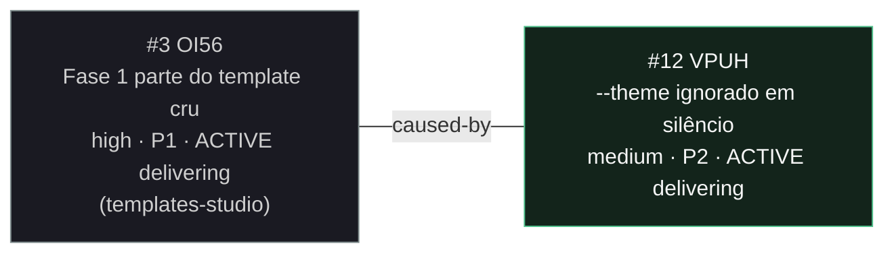

<!-- GENERATED, DO NOT EDIT: regenerado por /reversa-debugger-graph em 2026-08-01T01:30:00Z a partir de 1 bug -->

# Grafo de relações · cli-mira-animator

Aresta sólida: `supported`, com evidência.

## Cluster

Um bug só, ponta do cluster "geração de decks Studio pelo `/mira-fast`", que agora atravessa
três contextos e doze bugs.

O que este contexto acrescenta: os demais são do pipeline de geração; este é do CLI e atinge
quem nunca usou o `/mira-fast`. Encontrado por inspeção durante o diagnóstico do OI56, não
por relato — coerente com um defeito que não quebra nada visível.

## Impact score

`causados*3 + bloqueados*2 + regressões*4 + relacionados*1`, só arestas `supported` e
`confirmed`, `related-to` limitado a 3.

| # | ID | impact score | arestas contadas |
|---|---|---|---|
| 12 | VPUH | **1** | 1 (related-to com OI56) |

A aresta `caused-by` que o OI56 grava apontando para cá pontua **no OI56**, não aqui: ela diz
que o OI56 foi causado por este bug, então o peso de causa é dele. O 1 daqui vem da aresta
simétrica.

Heurística de triagem. Com doze bugs e a maioria das arestas ainda `proposed`, o score
diferencia pouco: ele só cresce onde alguém investigou, porque investigar é o que produz
evidência.
