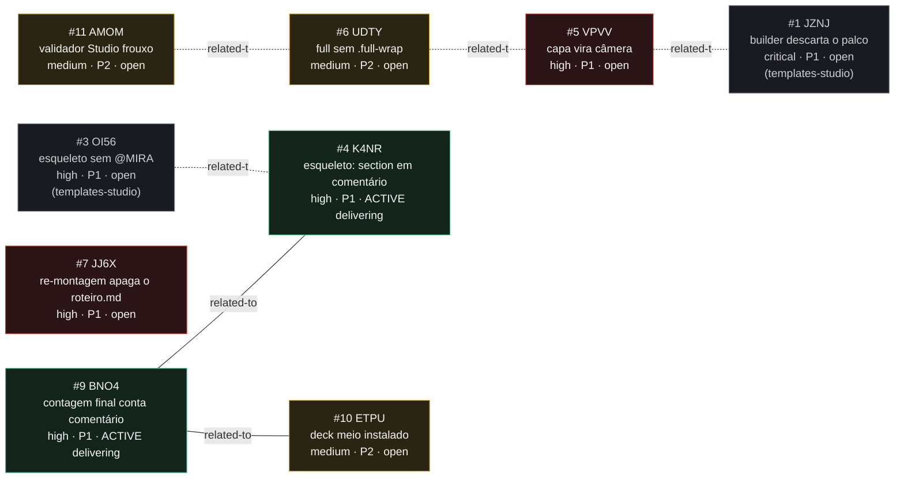

<!-- GENERATED, DO NOT EDIT: regenerado por /reversa-debugger-graph em 2026-07-31T23:55:00Z a partir de 7 bugs -->

# Grafo de relações · mira-fast

## Mermaid

Primeira vez que o registro tem arestas sólidas: as duas do BNO4 foram promovidas a
`supported` durante a correção de 2026-07-31. As demais continuam `proposed`, tracejadas.

## Clusters

### Cluster A: contrato de formato incompleto (VPVV, UDTY, AMOM)

Intocado pela correção de 2026-07-31. Três bugs num arquivo só,
`agents/mira-fast/references/formato-mira-studio.md`, escrito em 2026-07-26 a partir de um
template que existia desde 2026-07-12. O contrato transcreveu `camera` e `split` corretamente
e omitiu o envoltório de `capa` e de `full`, que é onde mora o CSS de cada layout.

Corrija os três juntos: contrato sem validador volta a divergir na próxima mudança do
template.

### Cluster B: `<section>` como texto, resolvido na raiz

`ETPU ── BNO4 ── K4NR`, as duas arestas agora `supported`.

**K4NR e BNO4 foram corrigidos.** A mesma regex ingênua estava em quatro pontos, e um deles
(`validate-run.mjs:131-133`) só apareceu durante o diagnóstico. Os quatro passaram a chamar
`countSections`, e a regra do que conta como elemento virou norma no adendo
`bug-BUG-20260731-K4NR-v001.md`, item R1d.

O que resta do cluster é o **ETPU**, e ele não depende do gatilho: a instalação parcial
acontece em qualquer falha posterior à linha 319 do `assemble-run.mjs`. Corrigir K4NR e BNO4
removeu a forma mais fácil de provocá-la, não a causa dela.

Vale registrar o padrão que este cluster deixou: o mesmo defeito foi contornado duas vezes
por caminhos diferentes (comentários reescritos numa instalação, `<section>` escapado para
entidade no `build-skeleton.mjs`) antes de alguém tratar a causa. O adendo agora proíbe
regex própria para essa pergunta.

### Isolado: JJ6X

Sem relação, intocado. Único bug do registro com sinal `data-corruption`.

## Impact score

`causados*3 + bloqueados*2 + regressões*4 + relacionados*1`, só com arestas `supported` e
`confirmed`, `related-to` limitado a 3.

| # | ID | impact score | arestas contadas | status |
|---|---|---|---|---|
| 9 | BNO4 | **2** | 2 (K4NR, ETPU) | active · delivering |
| 4 | K4NR | **1** | 1 (BNO4) | active · delivering |
| 10 | ETPU | **1** | 1 (BNO4) | open |
| 5 | VPVV | 0 | nenhuma | open |
| 6 | UDTY | 0 | nenhuma | open |
| 7 | JJ6X | 0 | nenhuma | open |
| 11 | AMOM | 0 | nenhuma | open |

O score deixou de ser inútil: até 2026-07-31 os 11 bugs estavam zerados porque nenhuma
aresta tinha evidência. Agora ele diferencia, mas **diferencia pouco e enviesado**: os dois
únicos bugs com score alto são os que acabaram de ser investigados, simplesmente porque
investigar é o que produz evidência. O ETPU herdou 1 sem ninguém tê-lo investigado.

Leia isso como o que é: heurística de triagem, e ainda parcial. `severity` e `priority`
continuam mandando. Um bug com score 0 aqui pode ser só um bug que ninguém olhou.
