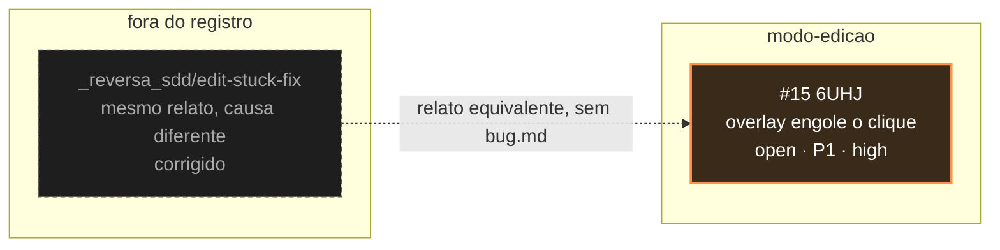

<!-- GENERATED, DO NOT EDIT: regenerado por /reversa-debugger-graph em 2026-08-01T21:56:00Z a partir de 1 bugs -->

# Grafo de bugs · modo-edicao

Um bug, sem arestas canônicas. A seta pontilhada não é relação tipada: marca que o mesmo sintoma
relatado pelo usuário já foi tratado uma vez, por outra causa, antes de existir o registro.
