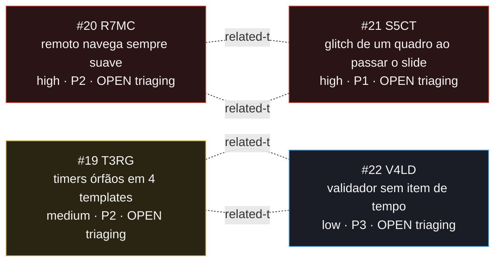

<!-- GENERATED, DO NOT EDIT: regenerado por /reversa-debugger-graph em 2026-08-18T15:11:00Z a partir de 4 bugs -->

# Grafo de relações · sincronia-temporal-slides

Aresta sólida é `supported` ou `confirmed`; tracejada é `proposed`, isto é, hipótese.
Neste contexto **todas** as arestas são tracejadas: nada foi provado ainda.

## Como ler este grafo

Dois pares, um por regra do documento do autor.

**Par da regra 1 (tempo do slide): T3RG ↔ V4LD.** Um é o defeito (timer solto em quatro
templates), o outro é a razão de ele ter sobrevivido tanto tempo (nada verifica). A ordem de
correção importa: o T3RG define qual é a regra, o V4LD escreve o item que a cobra. Inverter
produz validador que reprova o que o projeto aceita.

**Par da regra 2 (passagem de slide): S5CT ↔ R7MC.** O S5CT é o sintoma que o autor vê no
teclado; o R7MC é o mesmo assunto no caminho do celular, verificável por leitura de código.
Não são duplicata: caminhos diferentes, arquivos diferentes. Provável que a correção do S5CT
precise ser repetida no R7MC, e é por isso que a aresta existe.

Nenhuma aresta liga os dois pares. Eles compartilham o tema (o eixo do tempo) e nada mais:
mecanismos diferentes, arquivos diferentes, correções independentes.

## Sobre o S5CT

O sintoma é reprodutível e o autor o descreve com precisão. O que **não** está estabelecido é o
mecanismo: há três candidatos no corpo do bug, e o remédio proposto no documento de origem
acusa o menos provável dos três. Medir antes de aplicar não é burocracia aqui, é a diferença
entre corrigir num caminho e corrigir no lugar certo.
