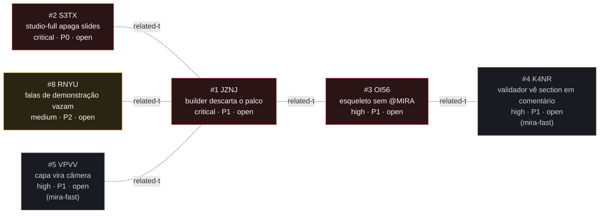

<!-- GENERATED, DO NOT EDIT: regenerado por /reversa-debugger-graph em 2026-07-31T22:40:00Z a partir de 4 bugs -->

# Grafo de relações · templates-studio

## Mermaid

Nenhuma aresta `supported` ou `confirmed` no registro. Todas as seis são `proposed` e
aparecem tracejadas.

## Clusters

**Cluster único, agora com 11 bugs em dois contextos: a geração de decks Studio pelo
`/mira-fast`.** Depois do pente-fino de 2026-07-31, o cluster tem três famílias, não duas.

1. **Contrato de esqueleto (OI56, K4NR, BNO4)**: o esqueleto herdado do template não passa
   no validador, e o validador reage a texto que menciona `<section>`. Falha alta e
   explícita, na hora.
2. **Contrato de ids e envoltórios (JZNJ, S3TX, VPVV, UDTY, AMOM)**: o que a Fase 2 escreve
   é descartado ou mal envolvido pelo runtime do template. Falha silenciosa, descoberta na
   gravação.
3. **Ciclo de vida do `roteiro.md` e das falas (JJ6X, RNYU)**: o arquivo governa os slides
   numa direção e é destruído na outra, e as falas do plano não alcançam o `file://`.

O nó de maior grau é o **JZNJ**, com quatro arestas. Não é o culpado de nada: é o ponto onde
o runtime do template e o contrato do `/mira-fast` se encontram, e por isso quase todo
defeito da área passa por ele.

**Ordem de ataque sugerida**, do relatório da varredura:

1. OI56 e K4NR: sem eles não existe deck Studio gerado do zero para reproduzir o resto.
2. VPVV, UDTY, AMOM juntos: contrato e validador na mesma correção, senão o contrato
   corrigido volta a divergir.
3. S3TX, o mais destrutivo e o único que atinge `file://`; depois JZNJ.
4. JJ6X e RNYU, que são independentes e podem ir em paralelo.

## Impact score

`causados*3 + bloqueados*2 + regressões*4 + relacionados*1`, contando só arestas
`supported` e `confirmed`, com o peso de `related-to` limitado a 3.

| # | ID | impact score | arestas contadas |
|---|---|---|---|
| 2 | S3TX | 0 | nenhuma |
| 1 | JZNJ | 0 | nenhuma |
| 3 | OI56 | 0 | nenhuma |
| 8 | RNYU | 0 | nenhuma |

Todos zerados: as seis arestas do registro estão em `proposed` e relação proposta não
pontua, por invariante. O score só passa a significar algo depois que o
`/reversa-debugger-fix` promover ou rejeitar as arestas com evidência.

Enquanto isso, ordene por `severity` e `priority`. Se quiser um desempate por conectividade,
o JZNJ é o nó mais central do grafo, mas isso é topologia, não impacto medido.
