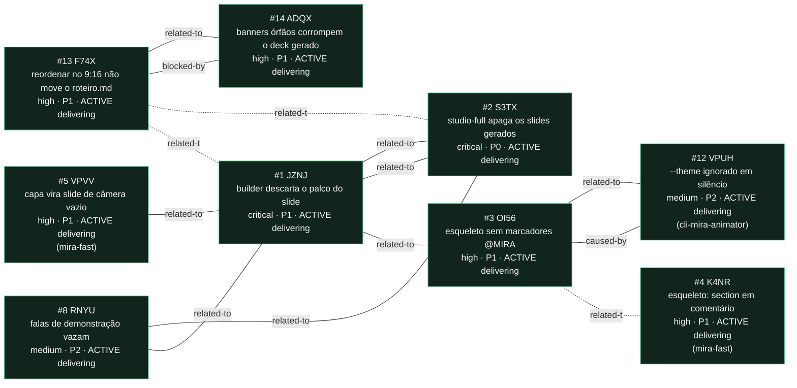

<!-- GENERATED, DO NOT EDIT: regenerado por /reversa-debugger-graph em 2026-08-01T17:45:00Z a partir de 6 bugs -->

# Grafo de relações · templates-studio

Aresta sólida é `supported` ou `confirmed`; tracejada é `proposed`, isto é, hipótese.

## Leitura

Os 6 bug(s) deste contexto estão em `delivering`: corrigidos, testes verdes, veredito de
spec registrado, aguardando merge e publicação. Nenhum `DONE.md` foi gravado, porque a
closure policy `package` não está satisfeita.

O contexto inteiro conta uma história só: os dois builders Studio evoluíram em paralelo e
cada correção ficou de um lado. JZNJ e S3TX eram a mesma política invertida em arquivos
diferentes. F74X é a mesma assimetria uma camada acima, no contrato de reordenação. ADQX
apareceu na reprodução do F74X e o bloqueava, e a aresta `blocked-by` sai sólida porque isso
foi medido, não suposto: sem a correção dele o Salvar recusava em deck gerado.

As duas arestas de F74X para JZNJ e S3TX continuam tracejadas de propósito. São leitura de
padrão, não evidência causal: a reprodução confirmou a causa do F74X sem precisar delas.

**Não coberto por nenhum destes seis:** o `mira-studio-full` tem o mesmo defeito do F74X em
deck gerado, medido nesta sessão e sem bug próprio.
