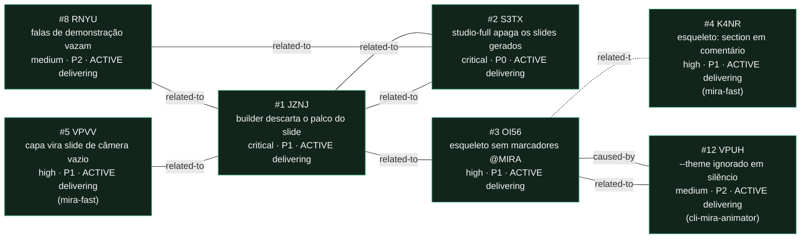

<!-- GENERATED, DO NOT EDIT: regenerado por /reversa-debugger-graph em 2026-08-01T06:00:00Z a partir de 4 bugs -->

# Grafo de relações · templates-studio

Aresta sólida é `supported` ou `confirmed`; tracejada é `proposed`, isto é, hipótese.

## Leitura

4 de 4 bug(s) deste contexto estão em `delivering`: corrigidos, testes verdes,
aguardando merge e publicação. Nenhum `DONE.md` foi gravado, porque a closure policy
`package` não está satisfeita.
