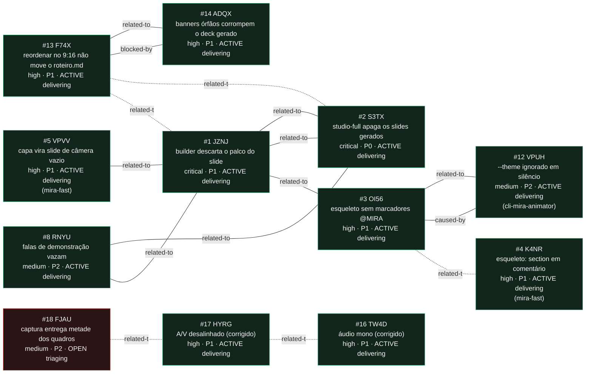

<!-- GENERATED, DO NOT EDIT: regenerado por /reversa-debugger-graph em 2026-08-16T21:05:00Z a partir de 9 bugs -->

# Grafo de relações · templates-studio

Aresta sólida é `supported` ou `confirmed`; tracejada é `proposed`, isto é, hipótese.

## Impact score dos bugs abertos e ativos

`causados*3 + bloqueados*2 + regressões*4 + relacionados*1`, contando SÓ arestas
`supported` e `confirmed`, com o peso de `related-to` limitado a 3 no total.

| bug | score | composição |
|---|---|---|
| JZNJ | 3 | 3 related-to supported (teto) |
| S3TX | 3 | 3 related-to supported (teto) |
| OI56 | 3 | 1 caused-by (3) + related-to proposed não conta |
| F74X | 3 | 1 blocked-by confirmed (2) + 1 related-to confirmed (1) |
| ADQX | 1 | 1 related-to confirmed |
| RNYU | 2 | 2 related-to supported |
| **TW4D** | **0** | 1 related-to `proposed`, que não conta |
| **HYRG** | **0** | 2 related-to `proposed`, que não contam |
| **FJAU** | **0** | 1 related-to `proposed`, que não conta |

Heurística de triagem, não substitui `priority`/`severity`. Os dois bugs do gravador têm
score 0 e são P1: score zero aqui significa "não puxa nem trava mais nada", não "pouco
importante". São os únicos do contexto que atingem o artefato final, o MP4 que o autor
publica.

## Leitura

O contexto conta **duas** histórias, em dois clusters que não se tocam.

**Cluster do builder (6 bugs, todos em `delivering`).** Os dois builders Studio evoluíram em
paralelo e cada correção ficou de um lado. JZNJ e S3TX eram a mesma política invertida em
arquivos diferentes. F74X é a mesma assimetria uma camada acima, no contrato de reordenação.
ADQX apareceu na reprodução do F74X e o bloqueava, e a aresta `blocked-by` sai sólida porque
isso foi medido, não suposto.

As duas arestas de F74X para JZNJ e S3TX continuam tracejadas de propósito. São leitura de
padrão, não evidência causal: a reprodução confirmou a causa do F74X sem precisar delas.

**Cluster do gravador (3 bugs).** TW4D e HYRG chegaram juntos em 2026-08-15, foram corrigidos
em 2026-08-16 e estão em `delivering`. O FJAU nasceu da medição dos outros dois e segue
`open`: registrado, não atacado. Os seis do builder estragam o
deck; estes dois estragam o arquivo que sai dele. A aresta entre eles é tracejada porque a
vizinhança é de código, não de causa: o mono nasce nas constraints do `getUserMedia`, o
deslocamento nasce no zeramento por trilha do muxer, e corrigir um não corrige o outro.

Nenhuma aresta liga os dois clusters. O gravador nunca foi tocado por nenhum bug do builder.

**O que os dois clusters têm em comum sem que isso seja aresta: assimetria entre 9:16 e
16:9.** No cluster do builder ela é a doença inteira. No do gravador ela quase não existe: o
caminho de áudio e o de relógio são **idênticos** nos dois arquivos, e a única assimetria é o
seletor de microfone, presente só no 16:9. É uma diferença importante de diagnóstico: no
builder o defeito é uma correção que ficou de um lado só; no gravador é uma decisão errada
igual nos dois.

**O HYRG não reabre o `c7a3222`.** Aquela correção tratou deriva progressiva por VFR e a
suíte dela passa 18/18. O HYRG é deslocamento constante, mecanismo distinto, anterior às
duas correções de relógio do gravador e sobrevivente das duas. Não há aresta `regression-of`
porque nada regrediu.

**Não coberto por nenhum destes oito:** o `mira-studio-full` tem o mesmo defeito do F74X em
deck gerado, medido em 2026-08-01 e sem bug próprio.
