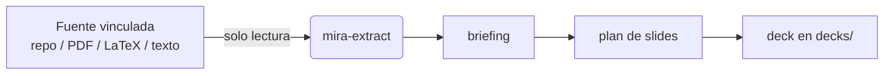

# Fuentes vinculadas

La idea central de Mira — la misma que comparte con [Reversa](https://github.com/sandeco/reversa) — es **aislamiento por vínculo**. Mira nunca se instala dentro del proyecto sobre el que quieres presentar. En su lugar, le dices dónde vive el contenido **vinculando fuentes**.

Los agentes **leen** de esas fuentes. **Escriben** solo en `decks/`. Tu material de origen nunca se modifica.

## Vincular una fuente

```bash
# una carpeta de otro proyecto
npx mira-animator link C:/proyectos/reversa --name=reversa

# un PDF en la carpeta actual
npx mira-animator link ./inbox/articulo.pdf

# un capítulo en LaTeX
npx mira-animator link ../libro/capitulo-03 --name=capitulo3 --type=latex
```

### Opciones

| Opción | Significado |
|---|---|
| `--name=<alias>` | Un alias corto para referirte a la fuente después (ej.: *"rellena el deck con el contenido de `reversa`"*). |
| `--type=<tipo>` | El tipo de fuente: `projeto` (carpeta/proyecto de código), `pdf`, `latex` o `texto`. Mira lo infiere si se omite. |

## Listar fuentes

```bash
npx mira-animator sources
```

Imprime cada fuente vinculada con su alias, tipo y ruta. La lista se guarda en `mira.config.json`.

## Cómo se usan las fuentes

Cuando creas un deck y le pides a Mira que lo rellene, el agente `mira-extract` lee la fuente vinculada y produce un **briefing** estructurado. Todo lo que sigue — el plan de slides, el texto, las animaciones — se construye a partir de ese briefing. Puedes vincular más de una fuente y elegir de cuál bebe un deck.



## Referencias por tema

Más allá de las fuentes vinculadas globalmente, un deck puede tener su propia carpeta local de **referencias** — material extra (PDFs, imágenes, diagramas, capturas) que debe informar solo a esa presentación. La skill `/mira-references` crea y organiza `references/` dentro de la carpeta del tema del deck e incluye automáticamente lo que dejes ahí.

Usa fuentes vinculadas para el contenido *principal* de un proyecto, y referencias por tema para el material de apoyo *específico* de un deck.

## La garantía

Sea lo que sea que vincules, la regla nunca cambia: **las fuentes son de solo lectura, `decks/` es lo único que Mira escribe.** Puedes apuntar Mira a un repositorio de producción o al PDF de un cliente sin ningún riesgo para el original.
