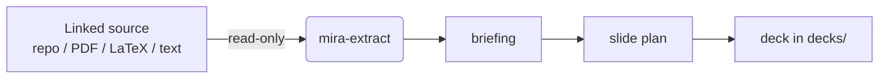

# Linked sources

The core idea of Mira — the one it shares with [Reversa](https://github.com/sandeco/reversa) — is **isolation through linking**. Mira is never installed inside the project you want to present. Instead, you tell it where the content lives by **linking sources**.

The agents **read** from those sources. They **write** only to `decks/`. Your source material is never modified.

## Linking a source

```bash
# a folder from another project
npx mira-animator link C:/projects/reversa --name=reversa

# a PDF in the current folder
npx mira-animator link ./inbox/paper.pdf

# a LaTeX chapter
npx mira-animator link ../book/chapter-03 --name=chapter3 --type=latex
```

### Options

| Option | Meaning |
|---|---|
| `--name=<alias>` | A short alias you use later to refer to the source (e.g. *"fill the deck with content from `reversa`"*). |
| `--type=<type>` | The source type: `projeto` (a code project / folder), `pdf`, `latex`, or `texto`. Mira infers it when omitted. |

## Listing sources

```bash
npx mira-animator sources
```

This prints every linked source with its alias, type and path. The list is stored in `mira.config.json`.

## How sources are used

When you create a deck and ask Mira to fill it, the `mira-extract` agent reads the linked source and produces a structured **briefing**. Everything downstream — the slide plan, the copy, the animations — is built from that briefing. You can link more than one source and choose which one a given deck draws from.



## Per-theme references

Beyond globally linked sources, a single deck can have its own local **references** folder — extra material (PDFs, images, diagrams, prints) that should inform only that presentation. The `/mira-references` skill creates and organizes `references/` inside the deck's theme folder and automatically includes whatever you drop there.

Use linked sources for the *main* content of a project, and per-theme references for the *specific* supporting material of one deck.

## The guarantee

Whatever you link, the rule never changes: **sources are read-only, `decks/` is the only thing Mira writes.** You can point Mira at a production repository or a client's PDF without any risk to the original.
