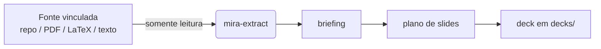

# Fontes vinculadas

A ideia central do Mira — a mesma que ele compartilha com o [Reversa](https://github.com/sandeco/reversa) — é **isolamento por vínculo**. O Mira nunca é instalado dentro do projeto sobre o qual você quer apresentar. Em vez disso, você diz onde o conteúdo vive **vinculando fontes**.

Os agentes **leem** dessas fontes. Eles **escrevem** somente em `decks/`. Seu material de origem nunca é modificado.

## Vinculando uma fonte

```bash
# uma pasta de outro projeto
npx mira-animator link C:/projetos/reversa --name=reversa

# um PDF na pasta atual
npx mira-animator link ./inbox/artigo.pdf

# um capítulo em LaTeX
npx mira-animator link ../livro/capitulo-03 --name=capitulo3 --type=latex
```

### Opções

| Opção | Significado |
|---|---|
| `--name=<apelido>` | Um apelido curto para você referenciar a fonte depois (ex.: *"preencha o deck com o conteúdo da `reversa`"*). |
| `--type=<tipo>` | O tipo da fonte: `projeto` (pasta/projeto de código), `pdf`, `latex` ou `texto`. O Mira infere quando omitido. |

## Listando fontes

```bash
npx mira-animator sources
```

Imprime cada fonte vinculada com apelido, tipo e caminho. A lista fica em `mira.config.json`.

## Como as fontes são usadas

Quando você cria um deck e pede ao Mira para preenchê-lo, o agente `mira-extract` lê a fonte vinculada e produz um **briefing** estruturado. Tudo dali em diante — o plano de slides, o texto, as animações — é construído a partir desse briefing. Você pode vincular mais de uma fonte e escolher de qual um deck vai beber.



## Referências por tema

Além das fontes vinculadas globalmente, um deck pode ter sua própria pasta local de **referências** — material extra (PDFs, imagens, diagramas, prints) que deve informar só aquela apresentação. A skill `/mira-references` cria e organiza `references/` dentro da pasta do tema do deck e inclui automaticamente o que você deixar lá.

Use fontes vinculadas para o conteúdo *principal* de um projeto, e referências por tema para o material de apoio *específico* de um deck.

## A garantia

Seja lá o que você vincular, a regra nunca muda: **fontes são somente leitura, `decks/` é a única coisa que o Mira escreve.** Você pode apontar o Mira para um repositório de produção ou o PDF de um cliente sem nenhum risco ao original.
