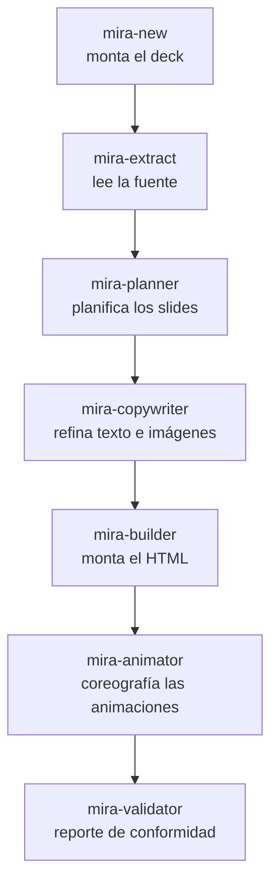

# Pipeline de agentes

Mira es un **equipo de agentes**. Cada uno hace un único trabajo y pasa al siguiente. El orquestador pausa entre las etapas para que tú estés en control.

## La línea principal

| Etapa | Agente | Qué hace |
|---|---|---|
| 0 | **mira-new** | Puerta de entrada conversacional. Monta `decks/<tema>/` (nombre, plantilla de deck, tema base, color, referencias). No genera slides — prepara el terreno. |
| 1 | **mira-extract** | Lee una fuente vinculada (proyecto, PDF, LaTeX o texto) y produce un **briefing** estructurado. Primer eslabón de la cadena. |
| 2 | **mira-planner** | Analiza el briefing y propone un **plan de slides** detallado, y espera tu aprobación antes de montar nada. |
| 3 | **mira-copywriter** | Refina el texto a la altura de slide y especifica imágenes. |
| 4 | **mira-builder** | El motor de montaje. Monta HTML/Tailwind interactivo a partir de cards glassmorphism modulares con navegación card por card. |
| 5 | **mira-animator** | Añade el movimiento. Cada slide de concepto recibe una animación creativa con **bucle interno obligatorio** — entra con coreografía y después entra en bucle. Estampa cada animación con el marcador `<!-- @MIRA:SIZE 3/10 -->`. |
| 6 | **mira-validator** | Analiza el HTML generado y produce un reporte de conformidad: chequeos visuales, estructurales y de assets. |

## Agentes de ajuste de movimiento

Estos corren sobre un deck existente.

| Agente | Qué hace |
|---|---|
| **mira-size-animator** | Lee el marcador `@MIRA:SIZE N/10` y escala la percepción de tamaño de las animaciones (radios, longitudes, espaciados, fuentes internas, glow) en una escala de 1 a 10, sin cambiar la altura del escenario ni romper el bucle. *"Pon las animaciones en 6/10."* |
| **mira-animated-metaphor** | Convierte la animación de un slide en una **metáfora visual** animada — una analogía concreta de la vida diaria para el concepto — manteniendo título, subtítulo y píldoras. |

## Agentes visuales / de imagen

| Agente | Qué hace |
|---|---|
| **mira-visuals** | Imágenes estáticas para slides: paneles, diagramas, gráficos e infografías. |
| **mira-image-prompt** | Monta prompts JSON para generación de imagen fotorrealista. |
| **mira-img-animator** | Anima una imagen existente. |
| **mira-chart** | Convierte datos en gráficos — a partir de CSV/JSON, de una imagen, o de un boceto a mano — y recomienda el mejor tipo de gráfico. |

## Agentes de apoyo

| Agente | Qué hace |
|---|---|
| **mira-references** | Crea y organiza la carpeta `references/` por tema; incluye automáticamente el material que dejes ahí. |
| **mira-get-videos** | Descarga los videos de fondo a `mira-templates/videos_header/`. |

## Agentes de formato

Estos producen archivos extra al lado de tu deck sin tocar el original. Mira [Formatos de vídeo](formatos.md).

| Agente | Salida | Formato |
|---|---|---|
| **mira-squared** | `index-1x1.html` | cuadrado 1:1 |
| **mira-vertical** | `index-9x16.html` | vertical 9:16 |
| **mira-thirds** | `index-thirds.html` | regla de los tercios |
| **mira-transition-dissolve** | `index-dissolve.html` | transición disolvencia |

Para la descripción completa de cada agente, mira [Agentes](agentes.md).
