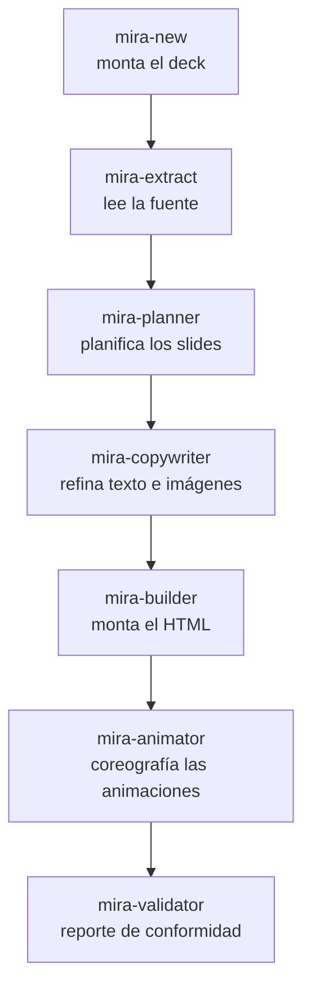

# Pipeline de agentes

Mira es un **equipo de agentes**. Cada uno hace un único trabajo y pasa al siguiente. El orquestador pausa entre las etapas para que tú estés en control.

## La línea principal

| Etapa | Agente | Qué hace |
|---|---|---|
| 0 | **mira-new** | Puerta de entrada conversacional. Monta `decks/<tema>/` (nombre, plantilla de deck, tema base, color, referencias). No genera slides — prepara el terreno. |
| 1 | **mira-extract** | Lee una fuente vinculada (proyecto, PDF, LaTeX o texto) y produce un **briefing** estructurado. Primer eslabón de la cadena. |
| 2 | **mira-planner** | Analiza el briefing y propone un **plan de slides** detallado, y espera tu aprobación antes de montar nada. |
| 3 | **mira-copywriter** | Refina el texto a la altura de slide y especifica imágenes. |
| 4 | **mira-builder** | El motor de montaje. Monta HTML/Tailwind interactivo a partir de cards glassmorphism modulares con navegación card por card. |
| 5 | **mira-animator** | Añade el movimiento. Cada slide de concepto recibe una animación creativa con **bucle interno obligatorio** — entra con coreografía y después entra en bucle. Estampa cada animación con el marcador `<!-- @MIRA:SIZE 3/10 -->`. |
| 6 | **mira-validator** | Analiza el HTML generado y produce un reporte de conformidad: chequeos visuales, estructurales y de assets. |

## Agentes de ajuste de movimiento

Estos corren sobre un deck existente.

| Agente | Qué hace |
|---|---|
| **mira-size-animator** | Lee el marcador `@MIRA:SIZE N/10` y escala la percepción de tamaño de las animaciones (radios, longitudes, espaciados, fuentes internas, glow) en una escala de 1 a 10, sin cambiar la altura del escenario ni romper el bucle. *"Pon las animaciones en 6/10."* |
| **mira-animated-metaphor** | Convierte la animación de un slide en una **metáfora visual** animada — una analogía concreta de la vida diaria para el concepto — manteniendo título, subtítulo y píldoras. |

## Agentes visuales / de imagen

| Agente | Qué hace |
|---|---|
| **mira-visuals** | Imágenes estáticas para slides: paneles, diagramas, gráficos e infografías. |
| **mira-img-animator** | Anima una imagen existente. |
| **mira-chart** | Convierte datos en gráficos — a partir de CSV/JSON, de una imagen, o de un boceto a mano — y recomienda el mejor tipo de gráfico. |
| **mira-chart-race** | Gráfico de carrera: datos temporales (CSV ancho) se reproducen una vez de principio a fin, barras que cambian de posición o líneas dibujadas en el tiempo. |
| **mira-image-template** | Crea una nueva plantilla de deck a partir de imagen(es) — capturas de pantalla y/o un logo — reconociendo el design system y la disposición de los elementos, y la registra para que `mira-new` la use. |

## Agentes de elementos en el slide

Estos colocan un elemento específico dentro de un slide.

| Agente | Qué hace |
|---|---|
| **mira-3d** | Añade un elemento 3D real (profundidad real, auto-rotación, arrastrar/zoom) en un card limpio, eligiendo CSS 3D, Three.js procedural o un `.glb` glTF. Un slide con `.glb` necesita un servidor HTTP local (el agente arranca uno y escribe un lanzador `abrir-slide.cmd`; necesita Node.js); CSS 3D y procedural se abren desde `file://`. |
| **mira-qrcode** | Inserta un código QR grande, centrado y escaneable a partir de un enlace o texto, generado localmente e incrustado como SVG inline, así que funciona desde `file://` sin dependencia en tiempo de ejecución. |
| **mira-survey** | Crea un slide de encuesta en vivo: un código QR para que el público vote en un Google Forms y un gráfico (donut 3D o barras) que se actualiza en tiempo real leyendo la planilla de respuestas vía el endpoint `gviz` por JSONP (funciona desde `file://`). Recibe el enlace de votación y el de la planilla; si falta uno, lo pide. |
| **mira-quiz** | Crea un slide de quiz en vivo: código QR para que el público responda en Google Forms, lectura de la planilla vía `gviz` por JSONP, revelación de la respuesta correcta controlada por el presentador y porcentajes visibles solo después de revelar. |
| **mira-image** | Coloca una imagen que ya tienes (archivo local o URL) en un slide, copiada a `assets/` y referenciada por una ruta relativa. Card limpio, imagen estática con el bucle en el marco. Funciona desde `file://` sin servidor. Para generar una imagen ver `mira-visuals`; para animar una ver `mira-img-animator`. |
| **mira-svg-morph** | Genera un slide donde una forma SVG se transforma en otra en bucle continuo (GSAP + MorphSVGPlugin vendorados localmente). Pasas 2+ archivos `.svg`; 2 van y vuelven, N se encadenan. Incrusta los paths inline con ids únicos y corre `convertToPath`. Funciona desde `file://`. |
| **mira-icon-morph** | El mismo morph a partir de conceptos en palabras: busca en la API de Iconify, valida la licencia (MIT/Apache/CC0/CC-BY), registra la atribución en `CREDITS.md` y rechaza IP protegida. Reaprovecha el núcleo de render de `mira-svg-morph`. |
| **mira-svg-animator** | Anima un SVG que provees: batir, girar, deslizar, pulsar, dibujar el contorno o seguir una curva (GSAP transform / DrawSVG / MotionPath, vendorado). Para mover una parte esta debe ser un elemento separado; en un path único fusionado, la skill separa la parte (corte por eje o edición del path) y quita fondos opacos. Funciona desde `file://`. |
| **mira-animated-typing** | La escena del "prompt tecleado en zoom": una sola línea de fuente mono de terminal gigante sobre fondo oscuro, tecleada carácter a carácter con cursor parpadeante estilo Windows; al llegar a 100px del borde derecho el texto se desliza a la izquierda con el cursor anclado. Color por tramo vía la etiqueta `color=#HEX` (la etiqueta nunca aparece). JS/CSS puro, bucle continuo, funciona desde `file://`. |

## Agentes de apoyo

| Agente | Qué hace |
|---|---|
| **mira-references** | Crea y organiza la carpeta `references/` por tema; incluye automáticamente el material que dejes ahí. |
| **mira-get-videos** | Descarga los videos de fondo a `mira-templates/videos_header/`. |

## Agentes de formato

Estos producen archivos extra al lado de tu deck sin tocar el original. Mira [Formatos de vídeo](formatos.md).

| Agente | Salida | Formato |
|---|---|---|
| **mira-squared** | `index-1x1.html` | cuadrado 1:1 |
| **mira-vertical** | `index-9x16.html` | vertical 9:16 |
| **mira-thirds** | `index-thirds.html` | regla de los tercios |
| **mira-studio** | `decks/<nombre>/` | deck de grabación 9:16 con cámara incrustada en vivo (listo para OBS) |
| **mira-studio-full** | `decks/<nombre>/index-16x9.html` | deck de grabación 16:9 full-hd con cámara incrustada, slides desde roteiro.md y teleprompter fuera del video |
| **mira-transition-dissolve** | `index-dissolve.html` | transición disolvencia |
| **mira-slide-to-video** | `deck.mp4` | video MP4 de la animación real de los slides |

Para la descripción completa de cada agente, mira [Agentes](agentes.md).
