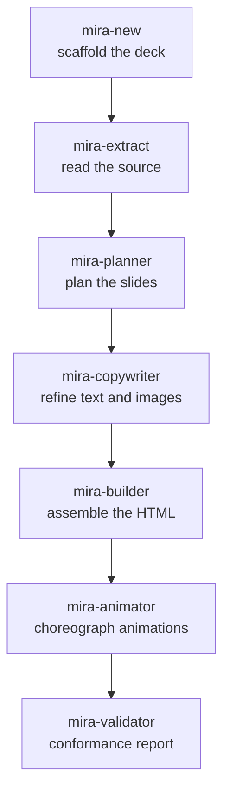

# Agent pipeline

Mira is a **team of agents**. Each one does a single job and hands off to the next. The orchestrator pauses between steps so you stay in control.

## The main line

| Step | Agent | What it does |
|---|---|---|
| 0 | **mira-new** | Conversational entry point. Scaffolds `decks/<theme>/` (name, deck template, base theme, color, references). Does not generate slides — it prepares the ground. |
| 1 | **mira-extract** | Reads a linked source (project, PDF, LaTeX or text) and produces a structured **briefing**. First link in the chain. |
| 2 | **mira-planner** | Analyzes the briefing and proposes a detailed **slide plan**, then waits for your approval before anything is built. |
| 3 | **mira-copywriter** | Refines the text to slide altitude and specifies images. |
| 4 | **mira-builder** | The assembly engine. Builds interactive HTML/Tailwind from modular glassmorphism cards with card-by-card navigation. |
| 5 | **mira-animator** | Adds the motion. Every concept slide gets a creative animation with a **mandatory internal loop** — it enters with choreography and then loops. Stamps each animation with a `<!-- @MIRA:SIZE 3/10 -->` marker. |
| 6 | **mira-validator** | Analyzes the generated HTML and produces a conformance report: visual, structural and asset checks. |

## Motion-tuning agents

These run on top of an existing deck.

| Agent | What it does |
|---|---|
| **mira-size-animator** | Reads the `@MIRA:SIZE N/10` marker and scales the perceived size of animations (radii, lengths, spacing, internal fonts, glow) on a 1–10 scale, without changing the stage height or breaking the loop. *"Put the animations at 6/10."* |
| **mira-animated-metaphor** | Turns a slide's animation into an animated **visual metaphor** — a concrete everyday analogy of the concept — keeping the title, subtitle and pills. |

## Visual / image agents

| Agent | What it does |
|---|---|
| **mira-visuals** | Static images for slides: panels, diagrams, charts and infographics. |
| **mira-img-animator** | Animates an existing image. |
| **mira-chart** | Turns data into charts — from CSV/JSON, from an image, or from a hand-drawn sketch — and recommends the best chart type. |
| **mira-chart-race** | Racing chart: temporal data (wide CSV) animates once from start to end, bars swapping rank or lines drawn over time. |
| **mira-image-template** | Builds a new deck template from image(s) — screenshots and/or a logo — recognizing the design system and the element layout, and registers it for `mira-new` to use. |

## On-slide element agents

These drop a specific element into a slide.

| Agent | What it does |
|---|---|
| **mira-3d** | Adds a true 3D element (real depth, auto-rotation, drag/zoom) in a clean card, choosing CSS 3D, procedural Three.js or a glTF `.glb`. A `.glb` slide needs a local HTTP server (the agent starts one and writes an `abrir-slide.cmd` launcher; needs Node.js); CSS 3D and procedural open from `file://`. |
| **mira-qrcode** | Inserts a large, centered, scannable QR code from a link or text, generated locally and embedded as inline SVG, so it works from `file://` with no runtime dependency. |
| **mira-survey** | Builds a live poll slide: a QR code for the audience to vote on a Google Form and a chart (3D donut or bars) that updates in real time by reading the responses spreadsheet via the `gviz` endpoint over JSONP (works from `file://`). Takes the voting link and the spreadsheet link; if one is missing, it asks. |
| **mira-quiz** | Builds a live quiz slide: QR code for the audience to answer in Google Forms, spreadsheet reading via `gviz` over JSONP, presenter-controlled correct-answer reveal, and percentages shown only after reveal. |
| **mira-image** | Places an image you already have (local file or URL) into a slide, copied into `assets/` and referenced by a relative path. Clean card, image static with the loop on the frame. Works from `file://` with no server. To generate an image see `mira-visuals`; to animate one see `mira-img-animator`. |
| **mira-svg-morph** | Generates a slide where one SVG shape morphs into another in a continuous loop (GSAP + MorphSVGPlugin vendored locally). You pass 2+ `.svg` files; 2 go back and forth, N chain. Inlines the paths with unique ids and runs `convertToPath`. Works from `file://`. |
| **mira-icon-morph** | The same morph from concepts in words: searches the Iconify API, validates the license (MIT/Apache/CC0/CC-BY), records attribution in `CREDITS.md`, and refuses protected IP. Reuses the render core of `mira-svg-morph`. |
| **mira-svg-animator** | Animates an SVG you provide: flap, spin, slide, pulse, draw the outline or follow a curve (GSAP transform / DrawSVG / MotionPath, vendored). To move a part it must be a separate element; for a single merged path it splits the part (clip by an axis or edit the path) and removes opaque backgrounds. Works from `file://`. |
| **mira-animated-typing** | The "prompt typed in zoom" scene: a single line of giant terminal monospace type on a dark background, typed character by character with a Windows-style blinking cursor; when it reaches 100px before the right edge the text slides left with the cursor anchored. Per-span color via the `color=#HEX` tag (the tag never shows). Pure JS/CSS, continuous loop, works from `file://`. |

## Helper agents

| Agent | What it does |
|---|---|
| **mira-references** | Creates and organizes the per-theme `references/` folder; auto-includes the material you drop there. |
| **mira-get-videos** | Downloads the background videos into `mira-templates/videos_header/`. |

## Format agents

These produce extra files next to your deck without touching the original. See [Video formats](formatos.md).

| Agent | Output | Format |
|---|---|---|
| **mira-squared** | `index-1x1.html` | 1:1 square |
| **mira-vertical** | `index-9x16.html` | 9:16 vertical |
| **mira-thirds** | `index-thirds.html` | rule of thirds |
| **mira-studio** | `decks/<name>/` | 9:16 recording deck with live embedded camera (OBS-ready) |
| **mira-studio-full** | `decks/<name>/index-16x9.html` | 16:9 full-hd recording deck with embedded camera, roteiro.md-driven slides and out-of-video teleprompter |
| **mira-transition-dissolve** | `index-dissolve.html` | dissolve transition |
| **mira-slide-to-video** | `deck.mp4` | MP4 video of the slides' real animation |

For the full description of each agent, see [Agents](agentes.md).
