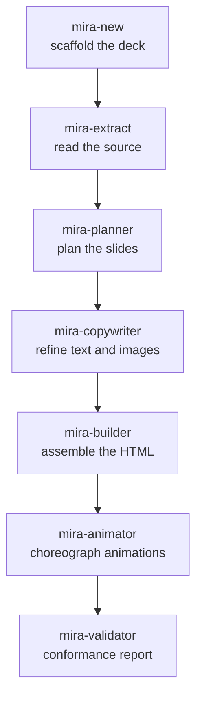

# Agent pipeline

Mira is a **team of agents**. Each one does a single job and hands off to the next. The orchestrator pauses between steps so you stay in control.

## The main line

| Step | Agent | What it does |
|---|---|---|
| 0 | **mira-new** | Conversational entry point. Scaffolds `decks/<theme>/` (name, deck template, base theme, color, references). Does not generate slides — it prepares the ground. |
| 1 | **mira-extract** | Reads a linked source (project, PDF, LaTeX or text) and produces a structured **briefing**. First link in the chain. |
| 2 | **mira-planner** | Analyzes the briefing and proposes a detailed **slide plan**, then waits for your approval before anything is built. |
| 3 | **mira-copywriter** | Refines the text to slide altitude and specifies images. |
| 4 | **mira-builder** | The assembly engine. Builds interactive HTML/Tailwind from modular glassmorphism cards with card-by-card navigation. |
| 5 | **mira-animator** | Adds the motion. Every concept slide gets a creative animation with a **mandatory internal loop** — it enters with choreography and then loops. Stamps each animation with a `<!-- @MIRA:SIZE 3/10 -->` marker. |
| 6 | **mira-validator** | Analyzes the generated HTML and produces a conformance report: visual, structural and asset checks. |

## Motion-tuning agents

These run on top of an existing deck.

| Agent | What it does |
|---|---|
| **mira-size-animator** | Reads the `@MIRA:SIZE N/10` marker and scales the perceived size of animations (radii, lengths, spacing, internal fonts, glow) on a 1–10 scale, without changing the stage height or breaking the loop. *"Put the animations at 6/10."* |
| **mira-animated-metaphor** | Turns a slide's animation into an animated **visual metaphor** — a concrete everyday analogy of the concept — keeping the title, subtitle and pills. |

## Visual / image agents

| Agent | What it does |
|---|---|
| **mira-visuals** | Static images for slides: panels, diagrams, charts and infographics. |
| **mira-image-prompt** | Builds JSON prompts for photorealistic image generation. |
| **mira-img-animator** | Animates an existing image. |
| **mira-chart** | Turns data into charts — from CSV/JSON, from an image, or from a hand-drawn sketch — and recommends the best chart type. |

## Helper agents

| Agent | What it does |
|---|---|
| **mira-references** | Creates and organizes the per-theme `references/` folder; auto-includes the material you drop there. |
| **mira-get-videos** | Downloads the background videos into `mira-templates/videos_header/`. |

## Format agents

These produce extra files next to your deck without touching the original. See [Video formats](formatos.md).

| Agent | Output | Format |
|---|---|---|
| **mira-squared** | `index-1x1.html` | 1:1 square |
| **mira-vertical** | `index-9x16.html` | 9:16 vertical |
| **mira-thirds** | `index-thirds.html` | rule of thirds |
| **mira-transition-dissolve** | `index-dissolve.html` | dissolve transition |

For the full description of each agent, see [Agents](agentes.md).
