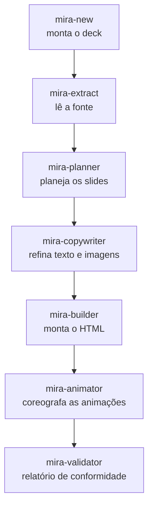

# Pipeline de agentes

O Mira é um **time de agentes**. Cada um faz um único trabalho e passa para o próximo. O orquestrador pausa entre as etapas para você ficar no controle.

## A linha principal

| Etapa | Agente | O que faz |
|---|---|---|
| 0 | **mira-new** | Porta de entrada conversacional. Monta `decks/<tema>/` (nome, template de deck, tema base, cor, referências). Não gera slides — prepara o terreno. |
| 1 | **mira-extract** | Lê uma fonte vinculada (projeto, PDF, LaTeX ou texto) e produz um **briefing** estruturado. Primeiro elo da cadeia. |
| 2 | **mira-planner** | Analisa o briefing e propõe um **plano de slides** detalhado, e espera sua aprovação antes de montar qualquer coisa. |
| 3 | **mira-copywriter** | Refina o texto para a altura de slide e especifica imagens. |
| 4 | **mira-builder** | O motor de montagem. Monta HTML/Tailwind interativo a partir de cards glassmorphism modulares com navegação card a card. |
| 5 | **mira-animator** | Adiciona o movimento. Todo slide de conceito ganha uma animação criativa com **loop interno obrigatório** — entra com coreografia e depois entra em loop. Estampa cada animação com o marcador `<!-- @MIRA:SIZE 3/10 -->`. |
| 6 | **mira-validator** | Analisa o HTML gerado e produz um relatório de conformidade: checagens visuais, estruturais e de assets. |

## Agentes de ajuste de movimento

Estes rodam por cima de um deck existente.

| Agente | O que faz |
|---|---|
| **mira-size-animator** | Lê o marcador `@MIRA:SIZE N/10` e escala a percepção de tamanho das animações (raios, comprimentos, espaçamentos, fontes internas, glow) numa escala de 1 a 10, sem mudar a altura do palco nem quebrar o loop. *"Coloca as animações em 6/10."* |
| **mira-animated-metaphor** | Transforma a animação de um slide numa **metáfora visual** animada — uma analogia concreta do cotidiano para o conceito — mantendo título, subtítulo e pílulas. |

## Agentes visuais / de imagem

| Agente | O que faz |
|---|---|
| **mira-visuals** | Imagens estáticas para slides: painéis, diagramas, gráficos e infográficos. |
| **mira-img-animator** | Anima uma imagem existente. |
| **mira-chart** | Transforma dados em gráficos — a partir de CSV/JSON, de uma imagem, ou de um rascunho à mão — e recomenda o melhor tipo de gráfico. |
| **mira-chart-race** | Gráfico de corrida: dados temporais (CSV largo) viram animação que toca uma vez e para no fim, barras que trocam de posição ou linhas desenhadas no tempo. |
| **mira-image-template** | Cria um novo template de deck a partir de imagem(ns) — prints de telas e/ou logomarca — reconhecendo o design system e a disposição dos elementos, e registra para o `mira-new` usar. |

## Agentes de elementos no slide

Estes inserem um elemento específico num slide.

| Agente | O que faz |
|---|---|
| **mira-3d** | Adiciona um elemento 3D de verdade (profundidade real, rotação automática, arrastar/zoom) num card limpo, escolhendo CSS 3D, Three.js procedural ou um `.glb` glTF. Um slide com `.glb` precisa de servidor HTTP local (o agente sobe um e gera um launcher `abrir-slide.cmd`; precisa de Node.js); CSS 3D e procedural abrem por `file://`. |
| **mira-qrcode** | Insere um QR code grande, central e escaneável a partir de um link ou texto, gerado localmente e embutido como SVG inline, então funciona por `file://` sem dependência de runtime. |
| **mira-survey** | Cria um slide de enquete ao vivo: QR-code para a plateia votar num Google Forms e um gráfico (donut 3D ou barras) que se atualiza em tempo real lendo a planilha de respostas pelo endpoint `gviz` por JSONP (funciona por `file://`). Recebe o link de votação e o da planilha; se faltar, pede. |
| **mira-quiz** | Cria um slide de quiz ao vivo: QR-code para a plateia responder num Google Forms, leitura da planilha via `gviz` por JSONP, resposta correta revelada pelo apresentador e porcentagens exibidas só depois da revelação. |
| **mira-image** | Coloca uma imagem que você já tem (arquivo local ou URL) num slide, copiada para `assets/` e referenciada por caminho relativo. Card limpo, imagem estática com o loop na moldura. Funciona por `file://` sem servidor. Para gerar uma imagem veja `mira-visuals`; para animar uma veja `mira-img-animator`. |
| **mira-svg-morph** | Gera um slide onde uma forma SVG morfa em outra em loop contínuo (GSAP + MorphSVGPlugin vendorados localmente). Você passa 2+ arquivos `.svg`; 2 vão e voltam, N encadeiam. Cola os paths inline com ids únicos e roda `convertToPath`. Funciona por `file://`. |
| **mira-icon-morph** | O mesmo morph a partir de conceitos em palavras: busca na API do Iconify, valida a licença (MIT/Apache/CC0/CC-BY), registra atribuição no `CREDITS.md` e recusa IP protegida. Reaproveita o núcleo de render do `mira-svg-morph`. |
| **mira-svg-animator** | Anima um SVG que você fornece: bater, girar, deslizar, pulsar, desenhar o contorno ou percorrer uma curva (GSAP transform / DrawSVG / MotionPath, vendorado). Para mover uma parte ela precisa ser um elemento separado; num path único fundido, a skill separa a parte (corte por eixo ou edição do path) e remove fundos opacos. Funciona por `file://`. |
| **mira-animated-typing** | Cena de "prompt digitado em zoom": linha única de fonte mono de terminal gigante sobre fundo escuro, digitada caractere a caractere com cursor piscando estilo Windows; ao chegar a 100px da borda direita o texto desliza para a esquerda com o cursor ancorado. Cor por trecho via tag `color=#HEX` (a tag nunca aparece). JS/CSS puro, loop contínuo, funciona por `file://`. |

## Agentes de apoio

| Agente | O que faz |
|---|---|
| **mira-references** | Cria e organiza a pasta `references/` por tema; inclui automaticamente o material que você deixar lá. |
| **mira-get-videos** | Baixa os vídeos de fundo para `mira-templates/videos_header/`. |

## Agentes de formato

Estes produzem arquivos extras ao lado do seu deck sem tocar no original. Veja [Formatos de vídeo](formatos.md).

| Agente | Saída | Formato |
|---|---|---|
| **mira-squared** | `index-1x1.html` | quadrado 1:1 |
| **mira-vertical** | `index-9x16.html` | vertical 9:16 |
| **mira-thirds** | `index-thirds.html` | regra dos terços |
| **mira-studio** | `decks/<nome>/` | deck de gravação 9:16 com câmera embutida ao vivo (pronto para OBS) |
| **mira-studio-full** | `decks/<nome>/index-16x9.html` | deck de gravação 16:9 full-hd com câmera embutida, roteiro.md e teleprompter fora do vídeo |
| **mira-transition-dissolve** | `index-dissolve.html` | transição dissolve |
| **mira-slide-to-video** | `deck.mp4` | vídeo MP4 da animação real dos slides |

Para a descrição completa de cada agente, veja [Agentes](agentes.md).
