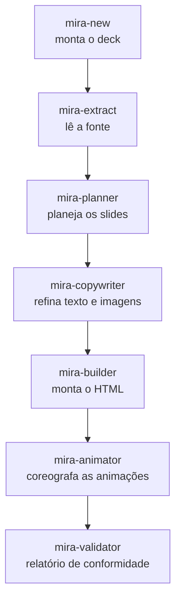

# Pipeline de agentes

O Mira é um **time de agentes**. Cada um faz um único trabalho e passa para o próximo. O orquestrador pausa entre as etapas para você ficar no controle.

## A linha principal

| Etapa | Agente | O que faz |
|---|---|---|
| 0 | **mira-new** | Porta de entrada conversacional. Monta `decks/<tema>/` (nome, template de deck, tema base, cor, referências). Não gera slides — prepara o terreno. |
| 1 | **mira-extract** | Lê uma fonte vinculada (projeto, PDF, LaTeX ou texto) e produz um **briefing** estruturado. Primeiro elo da cadeia. |
| 2 | **mira-planner** | Analisa o briefing e propõe um **plano de slides** detalhado, e espera sua aprovação antes de montar qualquer coisa. |
| 3 | **mira-copywriter** | Refina o texto para a altura de slide e especifica imagens. |
| 4 | **mira-builder** | O motor de montagem. Monta HTML/Tailwind interativo a partir de cards glassmorphism modulares com navegação card a card. |
| 5 | **mira-animator** | Adiciona o movimento. Todo slide de conceito ganha uma animação criativa com **loop interno obrigatório** — entra com coreografia e depois entra em loop. Estampa cada animação com o marcador `<!-- @MIRA:SIZE 3/10 -->`. |
| 6 | **mira-validator** | Analisa o HTML gerado e produz um relatório de conformidade: checagens visuais, estruturais e de assets. |

## Agentes de ajuste de movimento

Estes rodam por cima de um deck existente.

| Agente | O que faz |
|---|---|
| **mira-size-animator** | Lê o marcador `@MIRA:SIZE N/10` e escala a percepção de tamanho das animações (raios, comprimentos, espaçamentos, fontes internas, glow) numa escala de 1 a 10, sem mudar a altura do palco nem quebrar o loop. *"Coloca as animações em 6/10."* |
| **mira-animated-metaphor** | Transforma a animação de um slide numa **metáfora visual** animada — uma analogia concreta do cotidiano para o conceito — mantendo título, subtítulo e pílulas. |

## Agentes visuais / de imagem

| Agente | O que faz |
|---|---|
| **mira-visuals** | Imagens estáticas para slides: painéis, diagramas, gráficos e infográficos. |
| **mira-image-prompt** | Monta prompts JSON para geração de imagem fotorrealista. |
| **mira-img-animator** | Anima uma imagem existente. |
| **mira-chart** | Transforma dados em gráficos — a partir de CSV/JSON, de uma imagem, ou de um rascunho à mão — e recomenda o melhor tipo de gráfico. |

## Agentes de apoio

| Agente | O que faz |
|---|---|
| **mira-references** | Cria e organiza a pasta `references/` por tema; inclui automaticamente o material que você deixar lá. |
| **mira-get-videos** | Baixa os vídeos de fundo para `mira-templates/videos_header/`. |

## Agentes de formato

Estes produzem arquivos extras ao lado do seu deck sem tocar no original. Veja [Formatos de vídeo](formatos.md).

| Agente | Saída | Formato |
|---|---|---|
| **mira-squared** | `index-1x1.html` | quadrado 1:1 |
| **mira-vertical** | `index-9x16.html` | vertical 9:16 |
| **mira-thirds** | `index-thirds.html` | regra dos terços |
| **mira-transition-dissolve** | `index-dissolve.html` | transição dissolve |

Para a descrição completa de cada agente, veja [Agentes](agentes.md).
