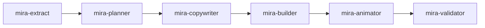

# Cómo usar

Esta página recorre el flujo completo, desde una carpeta vacía hasta un deck animado listo.

## 1. Instala y vincula

```bash
cd mi-carpeta-de-slides
npx mira-animator install
npx mira-animator link ../mi-proyecto --name=miproyecto
```

Mira [Instalación](instalacao.md) y [Fuentes vinculadas](fontes.md) para más detalles.

## 2. Crea un deck

La forma más amigable es la skill conversacional `/mira-new` dentro de Claude. Pregunta el nombre del tema, la plantilla del deck, el tema base, el color principal y referencias, luego monta la carpeta `decks/<tema>/` y ofrece accionar el pipeline.

O directo desde el CLI:

```bash
npx mira-animator new mi-clase --deck=aula-capitulo --theme=mira-dark
```

**Plantillas de deck**

| Plantilla | Para |
|---|---|
| `aula-capitulo` | Una clase o conferencia a partir de un capítulo / módulo |
| `pitch-projeto` | Un pitch de proyecto |
| `demo-tecnica` | Una demo técnica / walkthrough |

**Temas:** `mira-dark`, `light-minimal`, `corporate-blue`, `neon-emerald`.

## 3. Rellena el deck

De vuelta en Claude, apunta un deck a una fuente en lenguaje natural:

> *"rellena el deck mi-clase con el contenido de la fuente miproyecto"*

Esto dispara el [pipeline de agentes](pipeline.md):



Cada orquestador **pausa entre los agentes** y te mantiene en control. El planner, en particular, te muestra el plan de slides y espera aprobación antes de montar nada.

## 4. Ajusta las animaciones

Con el deck montado, puedes moldear el movimiento:

- **Tamaño** — *"pon las animaciones en 6/10"* o *"este slide está pequeño, déjalo en 7/10"*. El agente `mira-size-animator` escala la percepción de tamaño de cada animación en una escala de 1 a 10 (el valor por defecto que genera `mira-animator` es 3/10).
- **Metáfora** — *"convierte este concepto en una metáfora animada"*. El agente `mira-animated-metaphor` reemplaza la animación de un slide por una analogía concreta de la vida diaria, manteniendo el título y las píldoras.
- **Visuales** — pide a `mira-visuals` paneles estáticos, diagramas o infografías, o a `mira-chart` gráficos de datos a partir de un CSV/JSON, una imagen, o incluso un boceto a mano.

## 5. Abre y presenta

El deck es un `decks/mi-clase/index.html` autocontenido. Doble clic — corre desde `file://`, sin servidor. Navega card por card. Para hacer un video, graba la pantalla con el viewport ajustado a la resolución del formato objetivo.

## 6. Exporta a otros formatos (opcional)

A partir del mismo deck 16:9, sin tocar el original, puedes generar versiones cuadrada, vertical, en regla de los tercios y con transición disolvencia. Mira [Formatos de vídeo](formatos.md).

## Una nota sobre el idioma

Mira genera el contenido del deck en el idioma en que trabajas. La regla de idioma compartida vive en `agents/_shared/idioma.md` y la respetan todos los agentes, así que los slides salen en tu idioma, no en el predeterminado del agente.
