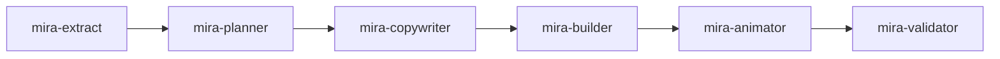

# How to use

This page walks the full flow, from an empty folder to a finished animated deck.

## 1. Install and link

```bash
cd my-slides-folder
npx mira-animator install
npx mira-animator link ../my-project --name=myproject
```

See [Installation](instalacao.md) and [Linked sources](fontes.md) for details.

## 2. Create a deck

Creating a deck is conversational — just talk to `/mira-new` inside Claude:

```text
/mira-new create a new presentation called 'my-talk'
```

It asks for the theme name, the deck template, the base theme, the primary color and any references, then assembles the `decks/<theme>/` folder and offers to trigger the pipeline. You can also spell out the template and theme up front:

```text
/mira-new create a presentation called 'my-talk' with the aula-capitulo template and the mira-dark theme
```

**Deck templates**

| Template | For |
|---|---|
| `aula-capitulo` | A class or lecture from a chapter / module |
| `pitch-projeto` | A project pitch |
| `demo-tecnica` | A technical demo / walkthrough |
| `animacao-livre` | A black stage with no text, only the Mira animation |

**Themes:** `mira-dark`, `light-minimal`, `corporate-blue`, `neon-emerald`.

## 3. Fill the deck

Back in Claude, point a deck at a source in plain language:

> *"fill the deck my-talk with content from the myproject source"*

This kicks off the [agent pipeline](pipeline.md):



Each orchestrator **pauses between agents** and keeps you in control. The planner, in particular, shows you the slide plan and waits for approval before anything is built.

## 4. Tune the animations

Once the deck is built, you can shape the motion:

- **Size** — *"put the animations at 6/10"* or *"this slide is too small, make it 7/10"*. The `mira-size-animator` agent scales the perceived size of each animation on a 1–10 scale (the default that `mira-animator` produces is 3/10).
- **Metaphor** — *"turn this concept into an animated metaphor"*. The `mira-animated-metaphor` agent replaces a slide's animation with a concrete everyday analogy, keeping the title and pills.
- **Visuals** — ask `mira-visuals` for static panels, diagrams or infographics, or `mira-chart` for data charts from a CSV/JSON, an image, or even a hand-drawn sketch.
- **3D, QR & images:** drop a real, auto-rotating 3D element with `/mira-3d`, a scannable QR code (from a link or text) with `/mira-qrcode`, or an image you already have with `/mira-image`. A 3D slide that loads a `.glb` needs a local server (the agent starts one and writes a double-click launcher); everything else opens from `file://`.
- **Shape morphing:** make one SVG shape morph into another in a loop with `/mira-svg-morph` (you pass the files), or `/mira-icon-morph` to do it from concepts in words, with icons sourced and licensed from Iconify.
- **Animate an SVG:** make an SVG you provide move (flap, spin, slide, pulse, draw) with `/mira-svg-animator`; if it is a single merged path, it splits the part to animate.

## 5. Open and present

The deck is a self-contained `decks/my-talk/index.html`. Double-click it — it runs from `file://`, no server needed. Navigate card by card. To make a video, screen-record with the viewport set to your target resolution.

## 6. Export to other formats (optional)

From the same 16:9 deck, without touching the original, you can generate square, vertical, rule-of-thirds and dissolve-transition variants. See [Video formats](formatos.md).

## A note on language

Mira generates the deck content in the language you work in. The shared language rule lives in `agents/_shared/idioma.md` and is honored by every agent, so the slides come out in your language, not the agent's defaults.
