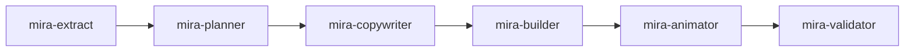

# How to use

This page walks the full flow, from an empty folder to a finished animated deck.

## 1. Install and link

```bash
cd my-slides-folder
npx mira-animator install
npx mira-animator link ../my-project --name=myproject
```

See [Installation](instalacao.md) and [Linked sources](fontes.md) for details.

## 2. Create a deck

Creating a deck is conversational — just talk to `/mira-new` inside Claude:

```text
/mira-new create a new presentation called 'my-talk'
```

It asks for **the theme name only**, then immediately creates the `decks/<theme>/` folder with `references/` ready and shows you its full path. There it stops and asks how you want to start: tell it in chat what the presentation is about, or drop your files (PDF, document, screenshots, links) into the references folder and say when you are done. Only after that does it ask for the rest (deck template, base theme, primary color), assemble the deck and offer to trigger the pipeline.

The folder comes first for a practical reason: if you already have the material in hand, you need somewhere to put it before deciding on a template and a color. Come back later, in the same session or a different one, and `/mira-new` recognizes the folder as a deck in progress, lists what it found in `references/` and picks up where you left off.

You can also spell out the template and theme up front:

```text
/mira-new create a presentation called 'my-talk' with the aula-capitulo template and the mira-dark theme
```

**Deck templates**

| Template | For |
|---|---|
| `mira-default` | **Default.** Title on top, animation filling the rest of the slide |
| `aula-capitulo` | A class or lecture from a chapter / module |
| `pitch-projeto` | A project pitch |
| `demo-tecnica` | A technical demo / walkthrough |
| `sandeco-just-animation-template` | A black stage with no text, only the Mira animation |

**Themes:** `mira-dark`, `light-minimal`, `corporate-blue`, `neon-emerald`.

### Shortcut: the whole deck in one go

If you would rather not go through steps 2 and 3 separately, [`/mira-fast`](agentes/core.md#mira-fast) does everything in a single call, generating the slides in parallel:

```text
/mira-fast spec driven development
/mira-fast /mira-vertical the book in references/my-book.pdf
```

It asks nothing, from topic to final HTML, which also means you do not get to approve the slide plan along the way. It creates the deck folder with `references/` before planning, and fails with a message if you point it at a source that does not exist. Requires **Dynamic workflows** enabled in `/config`.

## 3. Fill the deck

Back in Claude, point a deck at a source in plain language:

> *"fill the deck my-talk with content from the myproject source"*

This kicks off the [agent pipeline](pipeline.md):


```mermaid
flowchart LR
    E[mira-extract] --> P[mira-planner]
    P --> C[mira-copywriter]
    C --> B[mira-builder]
    B --> A[mira-animator]
    A --> V[mira-validator]
```

Each orchestrator **pauses between agents** and keeps you in control. The planner, in particular, shows you the slide plan and waits for approval before anything is built.

## 4. Tune the animations

Once the deck is built, you can shape the motion:

- **Size** — *"put the animations at 6/10"* or *"this slide is too small, make it 7/10"*. The `mira-size-animator` agent scales the perceived size of each animation on a 1–10 scale (the default that `mira-animator` produces is 3/10).
- **Metaphor** — *"turn this concept into an animated metaphor"*. `mira-animator` itself replaces a slide's animation with another concrete everyday analogy, in place, keeping the title and pills.
- **Visuals** — ask `mira-visuals` for static panels, diagrams or infographics, or `mira-chart` for data charts from a CSV/JSON, an image, or even a hand-drawn sketch, or `mira-chart-race` to make temporal data race over time (bars reordering by rank or lines drawing in).
- **3D, QR, quizzes & images:** drop a real, auto-rotating 3D element with `/mira-3d`, a scannable QR code (from a link or text) with `/mira-qrcode`, a live quiz with presenter-controlled correct-answer reveal using `/mira-quiz`, or an image you already have with `/mira-image`. A 3D slide that loads a `.glb` needs a local server (the agent starts one and writes a double-click launcher); everything else opens from `file://`.
- **Shape morphing:** make one SVG shape morph into another in a loop with `/mira-svg-morph` (you pass the files), or `/mira-icon-morph` to do it from concepts in words, with icons sourced and licensed from Iconify.
- **Animate an SVG:** make an SVG you provide move (flap, spin, slide, pulse, draw) with `/mira-svg-animator`; if it is a single merged path, it splits the part to animate.

## 4.5 The deck learns your taste

Mira keeps a local memory of your corrections. Every time you save in edit mode (key `E`), the delta between what the builder generated and what you fixed is appended to `~/.mira-memory/evidencia.jsonl`. Nothing leaves your machine.

- **Dictate a rule now:** `npx mira-animator memoria nota "less text per slide" --eixo densidade`. It becomes an active note immediately and the builder follows it on the next deck.
- **Let it learn on its own:** `npx mira-animator memoria consolidar` turns what repeated (3 episodes, 3 distinct decks, 2 sessions) into a **candidate** note. A candidate is never applied until you activate it with `memoria estado <file> ativo`.
- **Notes are yours:** they are plain markdown in `~/.mira-memory/notas/`. Open, edit, or revoke them. Revoking is a state, never a delete.
- **The brand always wins:** `#FF904D`, cover balance and safe area override anything the memory learned.

## 5. Open and present

The deck is a self-contained `decks/my-talk/index.html`. Double-click it — it runs from `file://`, no server needed. Navigate card by card. To make a video, screen-record with the viewport set to your target resolution.

## 6. Export to other formats (optional)

From the same 16:9 deck, without touching the original, you can generate square, vertical, rule-of-thirds and dissolve-transition variants. See [Video formats](formatos.md).

## A note on language

Mira generates the deck content in the language you work in. The shared language rule lives in `agents/_shared/idioma.md` and is honored by every agent, so the slides come out in your language, not the agent's defaults.
