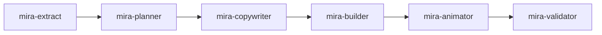

# Como usar

Esta página percorre o fluxo completo, de uma pasta vazia até um deck animado pronto.

## 1. Instale e vincule

```bash
cd minha-pasta-de-slides
npx mira-animator install
npx mira-animator link ../meu-projeto --name=meuprojeto
```

Veja [Instalação](instalacao.md) e [Fontes vinculadas](fontes.md) para detalhes.

## 2. Crie um deck

Criar um deck é conversacional — basta falar com o `/mira-new` dentro do Claude:

```text
/mira-new crie uma nova apresentação chamada 'minha-aula'
```

Ela pergunta o nome do tema, o template do deck, o tema base, a cor principal e referências, então monta a pasta `decks/<tema>/` e oferece acionar o pipeline. Você também pode já indicar o template e o tema na própria frase:

```text
/mira-new crie uma apresentação chamada 'minha-aula' com o template aula-capitulo e o tema mira-dark
```

**Templates de deck**

| Template | Para |
|---|---|
| `aula-capitulo` | Uma aula ou palestra a partir de um capítulo / módulo |
| `pitch-projeto` | Um pitch de projeto |
| `demo-tecnica` | Uma demo técnica / walkthrough |
| `sandeco-just-animation-template` | Um palco preto, sem texto, apenas para a animacao do Mira |

**Temas:** `mira-dark`, `light-minimal`, `corporate-blue`, `neon-emerald`.

## 3. Preencha o deck

De volta ao Claude, aponte um deck para uma fonte em linguagem natural:

> *"preencha o deck minha-aula com o conteúdo da fonte meuprojeto"*

Isso dispara o [pipeline de agentes](pipeline.md):



Cada orquestrador **pausa entre os agentes** e mantém você no controle. O planner, em particular, mostra o plano de slides e espera aprovação antes de qualquer coisa ser montada.

## 4. Ajuste as animações

Com o deck montado, você pode moldar o movimento:

- **Tamanho** — *"coloca as animações em 6/10"* ou *"esse slide está pequeno, deixa em 7/10"*. O agente `mira-size-animator` escala a percepção de tamanho de cada animação numa escala de 1 a 10 (o padrão que o `mira-animator` gera é 3/10).
- **Metáfora** — *"transforma esse conceito numa metáfora animada"*. O agente `mira-animated-metaphor` substitui a animação de um slide por uma analogia concreta do cotidiano, mantendo título e pílulas.
- **Visuais** — peça ao `mira-visuals` painéis estáticos, diagramas ou infográficos, ou ao `mira-chart` gráficos de dados a partir de um CSV/JSON, uma imagem, ou até um rascunho à mão.
- **3D, QR e imagens:** coloque um elemento 3D de verdade, que gira sozinho, com `/mira-3d`, um QR code escaneável (de um link ou texto) com `/mira-qrcode`, ou uma imagem que você já tem com `/mira-image`. Um slide 3D que carrega um `.glb` precisa de servidor local (o agente sobe um e gera um launcher de duplo-clique); todo o resto abre por `file://`.
- **Morph de formas:** faça uma forma SVG morfar em outra em loop com `/mira-svg-morph` (você passa os arquivos), ou `/mira-icon-morph` para fazer isso a partir de conceitos em palavras, com ícones buscados e licenciados na Iconify.
- **Animar um SVG:** faça um SVG que você fornece se mexer (bater, girar, deslizar, pulsar, desenhar) com `/mira-svg-animator`; se for um path único fundido, ele separa a parte a animar.

## 5. Abra e apresente

O deck é um `decks/minha-aula/index.html` autossuficiente. Dê dois cliques — ele roda de `file://`, sem servidor. Navegue card a card. Para fazer um vídeo, grave a tela com a viewport ajustada à resolução do formato alvo.

## 6. Exporte para outros formatos (opcional)

A partir do mesmo deck 16:9, sem tocar no original, você pode gerar versões quadrada, vertical, em regra dos terços e com transição dissolve. Veja [Formatos de vídeo](formatos.md).

## Uma nota sobre idioma

O Mira gera o conteúdo do deck no idioma em que você trabalha. A regra de idioma compartilhada vive em `agents/_shared/idioma.md` e é respeitada por todos os agentes, então os slides saem no seu idioma, não no padrão do agente.
